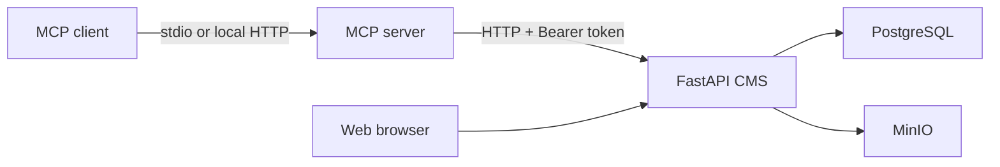

# CMS MCP Sandbox

A local development project that connects an MCP client to a small fictional CMS. It is designed for
learning and experimentation: everything runs on your machine, the content is fake, and no external AI
or production CMS is required.

The project includes:

- an MCP server with tools, resources, and workflow prompts;
- a FastAPI application that owns the CMS business rules;
- PostgreSQL for articles, revisions, permissions, and audit history;
- MinIO for uploaded media;
- deterministic content analysis using TF-IDF, cosine similarity, and shingles.

> This repository is a sandbox. Do not point it at a real CMS, production database, or company
> infrastructure. The development tokens and seeded content are intentionally fake.

## How it fits together



The MCP layer never writes directly to the database. It calls the FastAPI application, which validates
permissions and content rules before changing anything.

## Requirements

- Python 3.12 or newer
- [uv](https://docs.astral.sh/uv/)
- Docker Desktop

Node.js is optional and only needed for the MCP Inspector.

## Start the project

Open PowerShell in the repository folder, then run:

```powershell
Copy-Item .env.example .env
uv sync
docker compose up -d --build
docker compose run --rm fake-blog uv run alembic upgrade head
docker compose run --rm fake-blog uv run python scripts/seed.py
uv run python scripts/smoke_test.py
```

Once the checks pass, these local pages are available:

- blog: <http://127.0.0.1:8000/>
- diagnostics: <http://127.0.0.1:8000/admin>
- MinIO console: <http://127.0.0.1:9001>

PostgreSQL and MinIO listen only on `127.0.0.1`.

## Connect an MCP client

For a local stdio connection, use this executable as the server command:

```text
.venv\Scripts\cms-mcp.exe
```

Set the working directory to the repository root and provide these environment variables:

```text
MCP_TRANSPORT=stdio
BLOG_API_BASE_URL=http://127.0.0.1:8000/api/v1
BLOG_API_TOKEN=dev-editor-token
```

The executable is generated by `uv sync` from the `cms-mcp` entry in `pyproject.toml`. To inspect the
server without another client, run:

```powershell
uv run mcp dev apps/mcp_server/server.py
```

An optional Streamable HTTP server is also available:

```powershell
docker compose --profile mcp-http up -d --build
```

It listens locally at `http://127.0.0.1:8100/mcp`.

## Demo identities

The seed script creates several local identities:

| Token | Role | Access |
|---|---|---|
| `dev-reader-token` | reader | Read content |
| `dev-editor-token` | editor | Create and edit drafts, upload media |
| `dev-publisher-token` | publisher | Editor access plus publish and unpublish |
| `dev-admin-token` | admin | Full local access |
| `expired-demo-token` | expired | Test a predictable authentication failure |

These values are public test credentials and must never be reused outside this sandbox.

## Run the checks

```powershell
uv run ruff check .
uv run ruff format --check .
uv run mypy apps packages
uv run pytest -q
```

To rebuild the sample data:

```powershell
uv run python scripts/reset_local.py
uv run alembic upgrade head
uv run python scripts/seed.py
```
