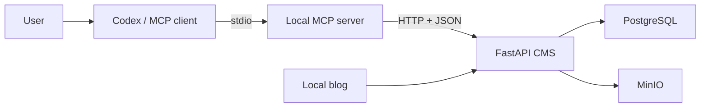
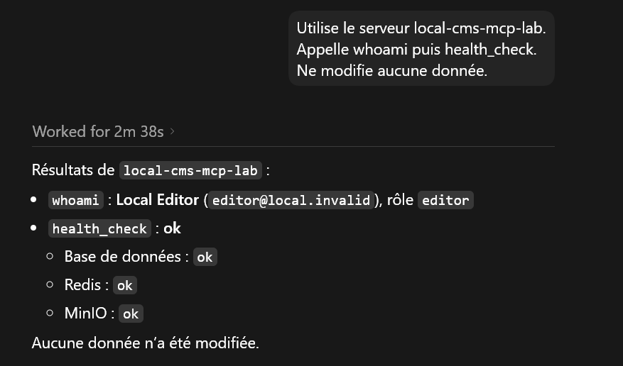
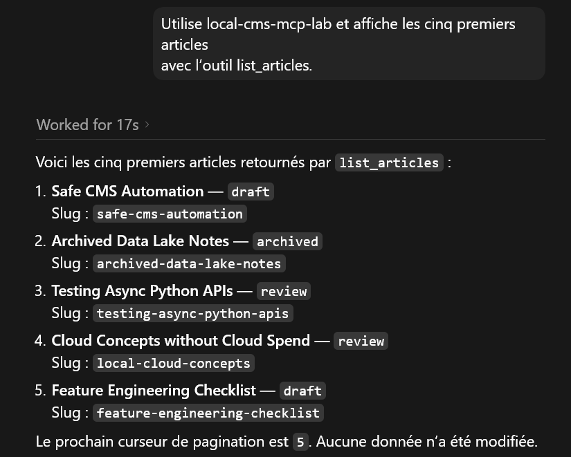
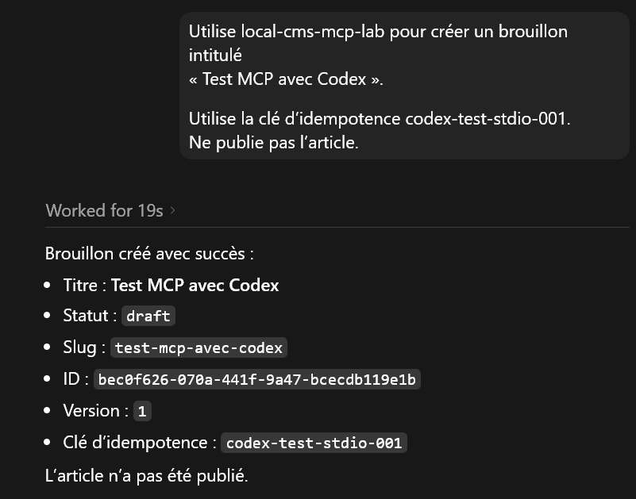
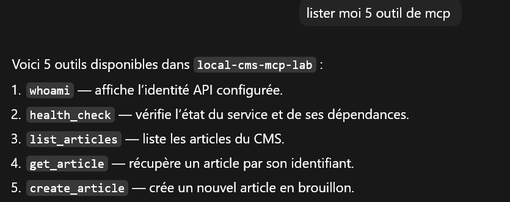

# Local CMS MCP Lab

I built this project to understand what happens when an MCP client works with a content management
system. The result is a small fictional blog that runs locally and can be queried or updated from Codex
through an MCP server.

The main design choice is that MCP never writes to the database directly. Every operation goes through
the FastAPI application, so the same validation, permissions, version checks and audit rules apply
whether the request comes from HTTP or from an MCP client.

## What is included

- a FastAPI CMS with articles, revisions, media, taxonomy and audit history;
- an MCP server exposing tools, resources and reusable prompts;
- PostgreSQL for relational data and MinIO for uploaded files;
- local readability, SEO and duplicate-content checks;
- test identities with reader, editor, publisher and administrator roles;
- Docker Compose for a repeatable local setup.

## Architecture



FastAPI remains the source of truth for the business rules. The MCP server is an adapter: it describes
the available actions, validates their arguments and translates tool calls into HTTP requests.

## A quick look

### Check the current identity and services

The first call uses `whoami` to show the configured CMS identity, then `health_check` to verify the local
services. Both operations are read-only.



### Read articles without opening the CMS interface

Here Codex calls `list_articles` and returns the first five items with their status and slug. The response
also includes the next pagination cursor.



### Create a draft safely

This example creates a draft with a fixed idempotency key. Reusing that key for the same request returns
the original result instead of creating a duplicate. The article stays in `draft`; publication requires a
different permission.



### Discover the available tools

An MCP client discovers the tools from the server instead of relying on a hard-coded menu. These are five
simple examples from the larger catalog.



## Run it locally

You need Python 3.12, [uv](https://docs.astral.sh/uv/) and Docker Desktop.

From PowerShell:

```powershell
Copy-Item .env.example .env
uv sync
docker compose up -d --build
docker compose run --rm fake-blog uv run alembic upgrade head
docker compose run --rm fake-blog uv run python scripts/seed.py
uv run python scripts/smoke_test.py
```

After startup:

- blog: <http://127.0.0.1:8000/>
- diagnostics: <http://127.0.0.1:8000/admin>
- API documentation: <http://127.0.0.1:8000/docs>
- MinIO console: <http://127.0.0.1:9001>

## Connect Codex over stdio

Create a local MCP server in Codex with these settings:

| Setting | Value |
|---|---|
| Name | `local-cms-mcp-lab` |
| Type | `STDIO` |
| Command | absolute path to `.venv\Scripts\cms-mcp.exe` |
| Working directory | absolute path to this repository |

Add the following environment variables:

```text
MCP_TRANSPORT=stdio
BLOG_API_BASE_URL=http://127.0.0.1:8000/api/v1
BLOG_API_TOKEN=dev-editor-token
```

The `cms-mcp.exe` launcher is created locally by `uv sync` from the entry point declared in
`pyproject.toml`.

Some useful prompts to try:

```text
Use local-cms-mcp-lab. Call whoami and health_check. Do not modify any data.

Use local-cms-mcp-lab and list the first five articles.

Create a draft named "Test MCP with Codex". Use the idempotency key codex-test-stdio-001.
Do not publish it.
```

## Roles used in the demo

| Token | Role | Main access |
|---|---|---|
| `dev-reader-token` | reader | read content |
| `dev-editor-token` | editor | create and edit drafts, upload media |
| `dev-publisher-token` | publisher | editor access plus publication |
| `dev-admin-token` | admin | full access to the local lab |
| `expired-demo-token` | expired | predictable authentication failure |

These are local test credentials. They are deliberately included for the sandbox and should not be reused
for another project.

## Run the checks

```powershell
uv run ruff check .
uv run ruff format --check .
uv run mypy apps packages
uv run pytest -q
```

The test suite covers the article lifecycle, permissions, optimistic concurrency, idempotency, media
validation, MCP discovery and local content analysis.

## Main directories

```text
apps/fake_blog/    FastAPI application and CMS rules
apps/mcp_server/   MCP server, tools and resources
migrations/        database schema history
scripts/           setup, seed and smoke-test commands
tests/             API, MCP, security and unit tests
```

This repository is intended for local learning and demonstrations. It is not configured for a public or
production deployment.
